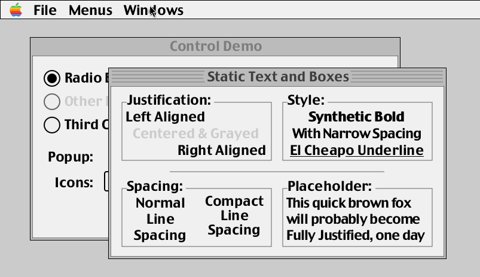
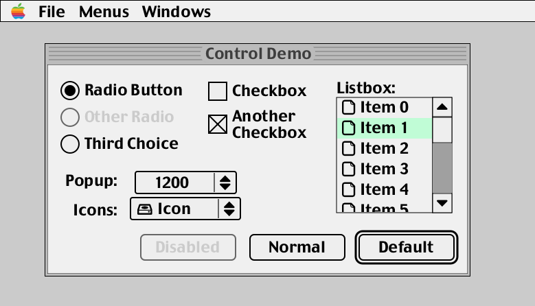
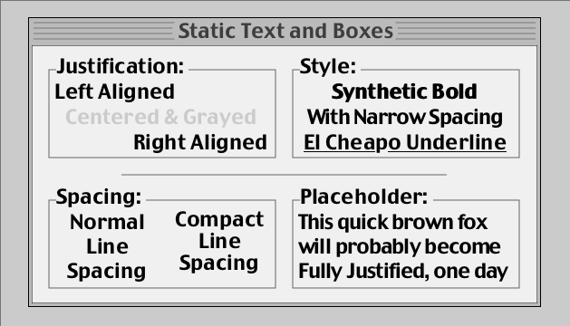
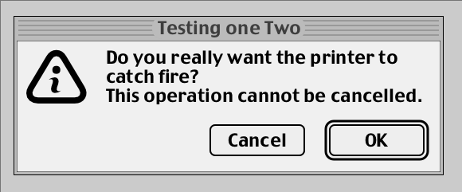
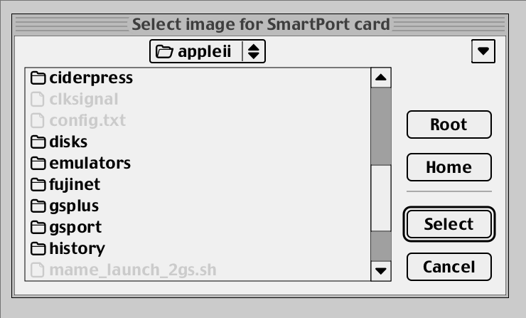

# What the hell is this?
This is a contender for the World Record for Feature Creep Side Project. It is pretty high in the contender list as it's a bolt on to *another* contender for the World Record for Feature Creep Side Project (the [MII Apple //e emulator](http://github.com/buserror/mii_emu)).

It is a library that duplicate a lot of a Macintosh Classic "Toolbox" APIs. It is not a complete implementation, but it is enough to make a few simple applications, also, all the bits I needed for the MII emulator.

   
   <i>10 seconds demo</i>

# Why?
Well I wanted a UI library for MII -- something without tons of dependencies, and I didn't want the typical 'game like' style with "Arrow Keys + Return + Escape" sort of menus.

I started with Nuklear immediate mode UI, but it both look super ugly, AND is very limited as soon as you want to do something 'custom', and I didn't see myself hacking into that codebase. One thing I particularly dislike is the 'layout' engine that decide to put stuff where it wants, and it's *never* in the 'right' place, like a hard case of 'computer say so' -- typicaly result into
something like Programmer's Art, just worse. That's why Linux On The Deskop is famous for it's Pixel Perfection polished UIs. *Cough*.

The other things I don't like with the trendy IM UIs is that they promise you that you don't have to keep a separate state around blah blah, however they forget to mention that there IS a state kept for you, based on hash values, and if you are unlucky enough to have a hash clash, you are screwed. I've seen that happen in real life, and it's not pretty to debug.

I miss the days were UIs were /crafted/ not just decided for you bad a bad 'layouting' engine with huge rectangular flat buttons and no sense whatsoever of 'design' or usability.

Also, I realized I had quite a few bits that I could use to make my own library anyway, so I started to do that.

Also, I like making my own toys. There, happy now?

   
   <i>Control Demo</i>

# What can it do?
Well, it has a few of the classic 'managers' that the Macintosh Toolbox had. Or the later GS/OS. However it behaves more like a modern system, it's not 'synchronous' like the old toolbox. Stuff gets redrawn even if you are clicking/dragging etc without having to 'do it yourself'.

It is designed to draw into a 'screen' that is an ARGB buffer. You can then copy that to wherever you fancy.
   * In the case of MII, it's an OpenGL texture that gets overlayed;
   * In the 'example' folder, the playground demo copies it to an X11 window via a XCB 'shared' pixmap, so works great even via remote X11.
The library is 'smart', like the old OSes, it keeps track of 'invalid' regions, and only redraws what is needed, so theres very very little overdraw.

One small drawback is that the output *has* to be ARGB -- so if you want to render say on a 16 bit framebuffer, you'll have to do the conversion yourself,
luckily, you only have to draw/convert the 'dirty' regions, so it's not too bad.

It could be possible to 'vectorize' the rendering to vertice buffers and stuff, but really, it's not needed, it's fast enough as it is and it would fall back the 'lets redraw everything' behaviour of the IMmediate UI libraries.

   
   <i>Some basic text boxes</i>

# How does it differ from the original?
Well, in terms of looks, it's kinda like I started with MacOS8/9, but removed all the grayscale bits.
Bizarelly, I think System 7 'flat' looks has aged better than the 'grayscale' look of 8/9, so I went with that. Most of the 'visible' difference are really related to the dialog's popup menus, which are a lot more 'OS8' than 'OS7'. The Scrollbar is definitely more GS/OS though, never understood why it took so long for MacOS to adopt that.

In terms of of the API, one massive change is that it is fully asynchronous, and
you *can't* just spinloop and draw things in a window or GrafPort whenever you feel like it, like on the original. Instead, you change the state of the UI, and it will redraw itself when it needs to. This is a lot more like modern UI libraries in that respect.

Many things will look familiar, if like me you were a developer back then,
I tried to use most of the names of things as is; and I even have all the
elements drawn by WDEF, CDEF, LDEF functions, which is fun. Also pretty easy
to customize. by adding your own, like in the old days.

Also, for the API, it's all 'callback' based. No more polling. You don't have
to 'ask' the UI if something happened, it will tell you when it does. This is
also a lot more like modern UI libraries.

It is also a lot simpler than the original in concept; everything is either a *mui_window* (Well, windows, menubars and menus) OR a *mui_control* (Menu titles, menu items, everything in windows, even separator lines).

## Window Manager
It can create windows, and it can draw into them. Has up to 15 'layers', and can do clipping and stuff. Got the typical 'BringToFront' behaviour, and you can drag windows around.

I deliberately limited the number of coordinate systems to 2 -- like the old one; so you get the 'screen coordinates' and the 'window content coordinates'. I was half tempted to create a fully hierarchical system, but realized it was really not neeeded, and would just make things more complicated.

It's a 'smart' window manager, it keeps track of an 'invalid' list of rectangles, and clips to that when redrawing, so it doesn't redraw the whole window every time, yeah, like the original. None of that 'lets redraw absolutely everything every frame' stuff like Immediate Mode UIs.
   - It's missing bits like 'zooming' (TODO), and 'resizing' (TODO).
   - It doesn't do transparent windows. It is by design, it draws windows 'top down' to optimize clipping -- adding transparency wouldn't be hard, but I'd have to draw the windows 'bottom up' to handle blending, and we'd revert back to drawing a lot of stuff for very little return.
   - Also, you can always alpha blend the whole *ui* 'screen' to wherever you want, so it's not like you can't have transparency.

## Menu Manager
Menubar, menus, checkmarks, keyboard shortcuts, all that stuff. Made to looks like System 7/8, or GS/OS. This was the most complicated bit to do, and it's still not perfect -- turns out the original had quite a few features that are not obvious at first glance.
   - It has hierarchical menus, they don't behave *perfectly* like the original yet, I'll have to revisit that for a better match.
   - It's missing displaying and scrolling super large popups (TODO).
   + It will call your 'action' callback when you click on a menu item, or when you press the key of a keyboard shortcut. Easy, peasy.
   + There is half baked support for sticky menus, but it's disabled for now as it's not quite right yet.

## Control Manager
Buttons, checkboxes, radio buttons, scrollbars (vertical), wrapping textboxes, all that stuff.
   - It's missing bits like Edit Field (Work in Progress), and a Slider.
   - There IS a prototype version of a text edit control, but it's not quite right yet -- works fine for a one liner etc, but not for a multi line text box. Not far off tho.
## List Manager
More or less hard coded to display filenames so far, but plain lists are actually easier than this so. Handle arrow keys/page up/down, scroll wheel, etc.
   - It's missing a way to 'compress' the font and/or use ellipsis abreviations (TODO) when the item text is too long.
   + You CAN use 'typeahead' to find the item you want, like the original.
## Alerts
It has the typical 'Cancel'+'OK' alert.
   - Could do with more types of alerts (TODO).

   
   <i>Basic Alert Dialog</i>

## Standard File
It has the classic 'Open' a file dialog. Haven't needed the other one. yet. This one one of the primary goal of the UI library to start with, so I spent quite a bit of time getting it 'right', quite happy about how it turned out.
   - Could do with a 'Save' dialog (TODO).
   + It has an extra popup with the last few used directories.
   - You can use arrow keys, page/up down, and you can even typehead to the file you want, like in the old MacOS!

   
   <i>Standard Get File</i>

## Resource Manager
Nope! Not there; I'd need some sort of ResEdit and stuff -- and now that is *ONE* Feature Creep Too Far thank you very much.
I have a vague idea of making some sort of MessagePack format for resources, but that's for another day.

# So, what *are* the dependencies?
Well, *external* dependencies are just *libpixman* -- that's it. It's a library that does pixel pushing, it's used everywhere, it's massively optimized, and it has 'regions' which are super useful for clipping -- they aren't *as good* as the regions in QuickDraw, but they are good enough.

Other bits I used to make it are rolled into the source code anyway, so it's not like you need to install them.
* libpixman: as mentioned, you'll need libpixman-dev installed.
* [libcg](https://github.com/xboot/libcg): a small antialiased renderer that looks vaguely like *cairo* but comes in just 2 files, with a nice licence. It's likely far from being the most optimized, but it's largely good enough.
* [stb_truetype.h](https://github.com/nothings/stb): a small library to load truetype fonts, it's used to load the system fonts.
* stb_ttc.h: my own extension to stb_truetype.h, makes up a font/glyph dictionary with hash tables, font textures etc.

That's it, all the other bits I already had 'in stock' -- the 2D geometry bits I made 25+ years ago, they were rolled in [libc3](https://github.com/buserror/simreprap) as well.

# How do I build it?
It's a simple Makefile, so you just need to do a 'make' in the root directory. It will build the library, and the tests/demos/samples.
To build the tests/demos/samples, you'll need:
* xcb xcb-shm xcb-randr xkbcommon-x11 -- this is just to run the 'mui_shell' demo, which is a simple window with a few buttons and stuff.
## Nvidia Driver gotcha
* *Note* that if you use the nvidia binary driver (I do), you will need to add a flag to your config, otherwise the mui_shell won't work.
   - Add: 'Option \"AllowSHMPixmaps\" \"1\"' to the "Device"  In your /etc/X11/xorg.conf file.

# How do I use it?
Well the best way is to hack around *mui_shell.c* and *mui_widgets_demo.c*. It's a simple window with a few buttons and stuff, and it's a good place to start.

The cool thing about ui_mui_shell is that it loads mui_widgets_demo.so as a *plugin* and auto-reload it if it detects a change. So you can hack around mui_widgets_demo.c, and it will reload it and run it again! You can code a new dialog insanely fast with that, pretty must as fast as you would with a resource editor.

A good trick is to use 'make watch' on the *libmui* directory in a terminal tab, and it will rebuild the library and the mui_shell automatically when you change something, that with the 'auto save' of your editor, and you will have a constantly building/running mui_shell as you hack around.

Have fun!

# FAQ!
  * Ok so, is there a dark mode?
     - nope
  * Fine, but at least it is themable, right?
     - nope
  * Tranparent Windows and a Cube Effect ?!@?!
     - nope
  * What, menu aren't sticky? They don't stay up when you release the mouse button? Common throw us a bone here man, it's 2023!
     - nope
  * But, is it at least using the super trendy tools? cmake? meson? ninja?
     - nope
  * What about autotools, seriously?
     - nope
  * Are there any bindings for any of the fancy new languages? Rust? Go? Python?
     - nope
  * Is it using any of the super trendy framerworks? GTK? QT?
     - nope
  * What about SDL? It's cross Platform, it is Ugly Everywhere Equally!
     - nope
  * And Wayland then? Wayland is The Future after all!
     - nope

<h1>Now, GET OFF MY LAWN!</h1>

